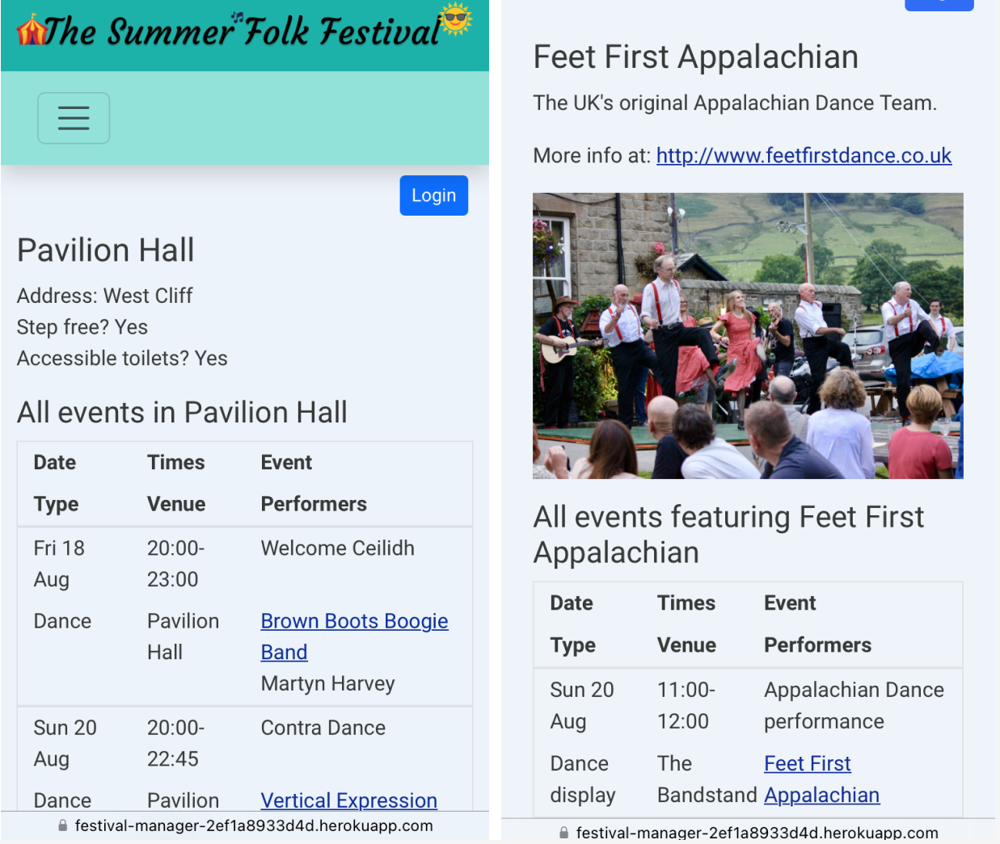

# Festival Events Manager

Festival Events Manager is a web-based app which enables members of a festival's organising team to enter their events information into a central database, and creates a public-facing online festival events programme using that information.

The app is displayed to users in two sections: one for staff users, and one for members of the public.

_Staff homepage on desktop and phone_

_Public homepage on desktop and phone_

A live version of the app can be accessed [on Heroku](https://festival-manager-2ef1a8933d4d.herokuapp.com/).

## Why this product is needed

Festivals are often organised by several people each working independently on their own section of the festival. For example, in the case of a folk festival, one person plans the concerts, another the workshops, another the ceilidhs/dances, another the dance teams displays, another the children's/family events.

However, they are all working to produce one single events programme for the festival as a whole. Sometimes a helping hand is needed to facilitate collaboration between several people working independently on different parts of the same project.

**Festival Events Manager** helps in two main ways:

1.  Enables event organisers to collaboratively create one central source of events information

Festival Events Manager enables each organiser to enter their events information into one central database, which can be viewed by all the organisers.  The benefits of this are:

-   _Version control_

A shared database simplifies version control as there is only one central version of the events programme, avoiding confusion about which set of information is most up to date.

-   _Facilitates information sharing between organisers_

Organisers can see each other's events during the planning process and so more easily avoid venue clashes or double booking of performers.

2.  Generates a public events programme

The Festival Events Manager takes the data entered by the organisers and, as each event is set to ‘public’ by the organisers, displays a festival events programme viewable by the public. The benefits of this are:

-   _Quicker and more flexible communication with the public_

Events are stored in ‘draft’ mode by default, and organisers can choose to add them to the public events programme as and when they are ready.

The public programme is updated in real-time, so potential attendees can get a taster of the events that will be available further in advance, increasing the likelihood that they will decide to buy a ticket and come to the festival.

This enables a more flexible way of communicating with audiences than the ‘traditional’ approach of waiting for a single, fully-completed programme document to be published in its entirety before releasing any event details to the public.

When changes need to be made (for example, if a performer calls in sick and needs to be replaced), the programme can be instantly updated, and the updates need to be made in one place only.

-   _Display information with various filters based on user need_

Using template code included in several pages, the app displays the following lists of events to the public:

 1. Full events programme (all events on all days)  
 2. Events taking place on each day (one list per day)
 3. Events featuring each performer (one list per performer)
 4. Events taking place in each venue (one list per venue)

This enables users to more easily view the information they are seeking, compared with simply reading a webpage, pdf document or paper programme listing all the events taking place. 

These lists are produced automatically without any extra action required by the organisers, saving them time and effort.

## Users of the product

### Staff users

The festival organisers. Particularly at grassroots event level, these people are often volunteers, have limited time available and have varying levels of tech knowledge. They need an interface that is quick and intuitive to use without having to make much effort to learn to use it.

### Public users

Members of the public. More specifically, this includes:

-   People deciding if they want to attend the festival, and if so, on which days they will attend
-   People who have already decided to attend, who want to find out what events there will be and make plans ahead of the festival
-   Festival attendees during the festival itself, who want to see what's on where and when and decide which event to go to next

Demographic factors such as age and experience with technology could vary widely depending on the individual festival using the software.

## Initial Planning

The following processes took place before commencing any coding.

### User Stories

The features of the app were planned by considering what the needs of a festival organiser or attendee would be in a real-life situation, thinking through what this user would therefore want to be able to do with the app, and then listing these needs as User Stories.

The User Stories used to plan this app can be viewed here: 

[User Stories as Google Sheet](https://docs.google.com/spreadsheets/d/115xDeqWRi2_llT213pvrN0uWyhkwoxC0/edit?usp=sharing&ouid=106676688339915491520&rtpof=true&sd=true) 

[User Stories as GitHub Project Board](https://github.com/users/charleymroberts/projects/2/views/1)

### Agile Development

This project was developed using an Agile development approach.  

First, the user stories were created to map out the needs of the product users, which are used as the foundation 
for developing the product.

A GitHub Project board (see link above) was used to:
- Manage the Product Backlog (i.e. the total list of tasks needing to be completed, in the form of user stories and epics) 
- Create epics (the main overall areas the project needs to address): 
  1. User Authentication 
  2. CRUD functionality (the staff user section)
  3. public-facing events programme (the public user section)
  4. User Interface design  
  
- Link user stories to epics (done here using labels)
- Prioritise user stories using the MoSCoW prioritisation scheme (Must-Have, Should-Have, Could-Have, Won't-Have)
- As they become ready to be completed, move the user stories into the 'Ready' column on the project board
- User stories selected for each sprint (see below) are moved into a column for that sprint and reprioritised to show 
their order of importance within that particular sprint. No more than around 60% of selected user stories per sprint 
should be 'must-haves'.
- User stories not completed within a given sprint move back onto the 'Ready' column for inclusion in future Sprints.

User stories were addressed a few at a time in five sprints (allocated dates) of around five days each.

The Timebox approach was used for this, meaning that the length of time available determines the amount of work 
completed in a sprint. (The Timebox is never extended to fit more work into it, tasks are reprioritised and added to a 
future sprint, or the decision can be made not to include them if they are of lower priority.)

### Database models

One of the first steps in producing this app was to design and implement custom data models based on the main categories of information that users would want to store and access.

An entity relationship diagram was created as part of planning the custom models.

Custom models were created for Event, Performer, and Venue classes.  Each event has one venue but can have many performers. Each performer can have many events.

The database will also include the standard user group and permission models provided by Django.  The distinction between staff users and public users is handled using the Django permissions mechanism.

(Public users will be able to log in in a future version of the app, but this feature did not make it into this iteration. The permissions needed to view staff pages remain in place in the code, so unauthorised users cannot access any of the staff pages by signing up for an account.)

### User Interface design planning

Initial wireframes were sketched on paper, based around a Bootstrap 12-column model of flexible layouts.

The main UI/UX design considerations for this app are:

| Design consideration | Reason needed |
|--|--|
| Mobile-first responsive design | Best practice |
|  | Attendees will be accessing the programme on their phones during a festival |
| Body text and layout clear to read | Lots of information being presented in the events programme, needs to be easily understood |
| Consistent layout across pages | Ease of use / Intuitiveness |
| Navigation options clearly presented on every page |  Ease of use / Intuitiveness |
| Minimalistic style with few images | Makes app quicker to load, important if large numbers of people in same place (possibly in a field with poor signal) accessing it at same time |
||Can be easily customised with customer festival's own branding. A fairly minimal style allows potential customers to imagine the app with their own branding

**Font and colour choices**

- Header and public site navbar background colours: blue-green colours (header #20b2aa, navbar #94e3dc)  to invoke either a field or park or a seaside town (common locations for festivals).

- The staff site navbar uses yellow (#f5d740) to distinguish it from the public site and provide a visual cue to the user about which part of the app they are in.

- Button colours: yellow (using Bootstrap btn-warning class) to invoke the sun/summer (while also being good for visual contrast).

- Dark font colours for the body (off-black #363837), navbar (dark grey #363b37) and jumbotron (black #000) text and an off-white body background colour (#edf4fa) were chosen to provide sufficient background/foreground contrast to be accessible. Link text was changed from the default bright blue to a darker blue (#082c99) in order to pass through the Lighthouse accessibility checker.

- Banner and navbar fonts (Courgette and NeoRetroDraw) are fun and informal to reflect a fun festival atmosphere, while still being clearly legible.

- Body font: Roboto was chosen as it is neutral and legible.  The main consideration is ease of reading a lot of information at once.

## Features

### Summary of functionality

Staff users can:

-   Sign up for an account
-   Log in and out of their account
-   Add new events
-   Edit events they've already added
-   Set their events to 'public' once ready to be published to the public events programme
-   View a list of all events (in draft and public form) added by all staff users
-   Add venue details (name, location, accessibility information)
-   Add performer details (name, biog, photo, web link)

Public users can:

-   View the full public events programme
-   View a list of events on each day (one day per page)
-   View a list of performers
-   Click through to information about each performer, including their photo, biography and link to their website or social media, and a list of all events they are appearing in
-   View a list of venues
-   Click through to information about each venue, including location and accessibility information, and a list of all events taking place in that venue

### Staff pages

This section is likely to be used more often on desktop or laptop computer by staff working on inputting events data, so mainly used larger screen size screenshots are included here to illustrate.

**Homepage**

- Dashboard clearly displaying the options available to the user.

- Navbar providing easy navigation to each section.  Remains the same across the whole staff site.  Displays as a hamburger menu on small and medium-sized screens. Is a different colour from the public site to provide visual cue to which section of the app the user is currently in.

- Quick links to log in and out (also displays current login status), and switch between the staff and public sections of the app.  These remain the same across all parts of the app.

**All Events/Performers/Venues pages**

Each page displays a list of information added so far under each category. 

- ‘Add’ buttons are clearly present in the top centre of the page.

- ‘Edit’ links are positioned next to each piece of information.

- On the ‘All Events’ page, ’draft’ and ‘public’ events are indicated with red and green bold text.

**Add/Edit events/performers/venues pages**

- The 'Add' and 'Edit' forms all have a simple design which aims to make information easy to input and ensure consistent input formats.

- The 'Add Event' form has a date selector and time selectors to make sure users input data in a correct and consistent format.

- The 'web link' field in the 'Add Performer' form automatically makes link text into clickable links.

- The delete button on each form is in red and positioned further away from the form than the add or edit button, to avoid accidental pressing of the wrong button. 

- When pressed, the delete button pops up an alert, ‘Are you sure you want to delete this [event/venue/performer]?’ which the user must confirm in order to proceed.

**Info boxes**

The app displays messages throughout to confirm user interactions: 
- information has been added, edited or deleted successfully.
- the user has logged in or out.

**Authorisation to view staff pages**

Different levels of authorisation are set for logged-in staff users vs logged-in public users using decorators on the view functions. `@login_required` decorators simply require the user to be logged in, and the addition of a `@permission_required` decorator plus a specific permission restricts access to users who have had that permission manually granted by the superuser via the admin panel (typically by creating a group with all the staff permissions assigned and then adding users to that group).

At present, signing up and logging in does not grant any additional access unless it is manually added by the superuser (i.e. access that would be granted to members of the organising team).  Due to time constraints it was not possible to add extra features for logged-in public users in this version of the app, but it is hoped that the facility for public users to log in and create a list of ‘favourite’ events would be added in the next iteration (see the ‘Unfixed Bugs’ section of this document for further explanation).

### Public pages

Users will be using the public section of the app mainly on their phones during a festival, so phone screen screenshots are included here to illustrate.

**Landing page**

- Landing page with concise explanation of what the site is for and a clear call to action.

- Eyecatching image conveying a festival atmosphere (can be replaced with festival’s own images in real-life deployment).

- Background behind the text to provide extra background/foreground contrast for accessibility.

- Placeholder banner image making it clear whose the site is (in real-life deployment would be replaced with each festival’s own name/logo/branding). Banner image is a hyperlink back to the landing page (from all pages).

- Navbar clearly displaying the user’s options, remains the same throughout the public site.  Displays as a hamburger menu on small and medium-sized screens.

**Events programme page**

Programme information displayed using the Bootstrap grid layout. The layout used aims to make numerous pieces of information clear to read and understand.

The same layout and appearance is replicated across other pages with events listings, to provide visual consistency for the user.

**Events by day/performer/venue pages**

These enable the user to quickly view specific information they are seeking.

Index pages: 

- Clear yellow buttons to display user options 

- Buttons fade slightly on hover (on desktop/laptop) to indicate that they are clickable

The individual pages provide:

- Events by day: a list of events on each day

- Performer info: provides further details about each performer, and a list of all events featuring that performer

- Venue info: provides location and some accessibility information, plus a list of events taking place there

### Future features

There are various useful features which could be included in future iterations of this app, which were not able to be implemented within the timebox available for this version.

- **Favourites**

The main feature that would be implemented in a future iteration is the facility for public users to select events as ‘favourites', which would store them in a list of 'favourites' visible only to that user. This feature would be particularly valuable to users at a multi-day festival with many different events, to help them plan in advance which events they definitely did not want to miss.

- **GDPR compliance**

Before being launched as a real-world product the app would need to be made GDPR compliant, such as including a terms and conditions page, privacy policy (including stating how email and IP addresses are used) and cookies policy.

- **Social media login**

Django Allauth (currently used to handle signups and logins) does have the capacity to allow login with third-party social media accounts. This could be enabled in a future iteration to encourage public users to sign up when login-required features for public users are available (as it requires less effort than creating a new account and password).

- **Information filtering on the staff pages**

The ability to filter the events list by properties such as performer name or venue could be applied to the staff events list.  This would help organisers to quickly check which events an individual performer is booked for, or see if there are any timetable gaps in a particular venue.

- **Filtering by type of event / Addition of an ‘event type’ form selector**

The ability to filter the events list by event type could be added to public and staff events list. This would be a useful feature for public users who are primarily interested in attending one type of event (such as people who mainly go to concerts rather than dances or workshops, or people looking for the child-friendly events).

It would be desirable in this case to first add a pre-determined list of event types to the ‘add event’ form, to ensure consistency in the data entered. This is likely to involve creating a custom database model for event type.

- **More styling on the events lists to increase readability**

The events lists are deliberately fairly plain in the current version.  Additional styling could be added to help with ease of reading, in order to help users more quickly skim-read the events lists and identify events they are interested in.

This could include:

- colour-coded text or background for each event type or each venue
-   alternating shaded and unshaded backgrounds for each event
-   icons next to the date, time or event type to visually indicate the type of information in that field.

## Technologies used

### Languages and frameworks

- Django
- Python
- Bootstrap 5
- HTML5
- CSS3 & webfonts (Google Fonts and fontsquirrel)
- JavaScript (for delete confirmation event handlers only)

### Databases

- PostgreSQL via ElephantSQL (in deployment)
- sqlite3 (local development)

### Platforms

- Cloudinary (static file and media storage)
- Heroku (deployment platform)
- Github (version control, project boards)

### Design tools

- Figma (banner image)
- LucidChart (ER diagram)

## Testing

### Unfixed bugs

The ‘login’ link is visible on the public site, and is visible to non-logged-in users. 

The original plan for the app included the ability for public users to log in and create a list of favourite events, so the link was added to public pages.  Additional permissions have already been added to the staff pages to prevent public users from seeing them when logged in.  However, this feature has been reassigned to a future implementation due to time constraints. 

The link is fairly unobtrusive, and no harm can be done if a public user tries to sign up for an account, as a superuser needs to manually add the permissions required to view any of the staff pages. 

It has the advantage that staff users can find the login link without needing to have the direct login URL (such as needing to access the site on their phone when the details are saved on their desktop computer).

It was therefore decided to leave the link in place rather than remove it, although this does mean that a member of the public could sign up for an account and be 'logged in' even though that would give them no additional access or functionality.

It is hoped that the public login function will be added as a future feature, so the link remains in place in readiness for this.

## Deployment process

Deployment was carried out by following the walkthrough videos in the Code Institute course material 'Hello Django > Deployment'.

### Summary

The deployed version is hosted by Heroku using gunicorn, with a PostGres database provided by Elephant SQL

Static files and media uploads are uploaded to Cloudinary

`settings.py` takes deployment-specific configuration (database settings, Django secret key, cloudinary API credentials) from environment variables.  In the deployed version these are set using the Heroku config vars.

### Steps followed

 - Create new app on Heroku
   
  - Create new instance on ElephantSQL
   
  -  Create Procfile
   
  - Add gunicorn to Procfile
   
   - Add gunicorn, dj_database_url, psycopg2 to requirements.txt
   
   - To manage different settings required by Heroku version vs local
   version, in env.py and settings.py:
   
	   - change database settings in settings.py to use os.environ[‘DATABASE_URL’]
   
	   - set DATABASE_URL to sqlite:///db.sqlite3 in env.py for local use
   
   - Add config vars to Heroku:
   
	   - copy the database URL from ElephantSQL and add to heroku settings as DATABASE_URL variable
	   
	   - generate a random secret key and put it in DJANGO_SECRET_KEY
	   
	   - set CLOUDINARY_URL with the URL copied from Cloudinary
	   
	   -   add PORT: 8000
   
  - Connect Github to Heroku in 'deploy', click deploy branch, enable
   automatic deployments
   
 -  Create the initial database using the command 'heroku run python3 manage.py migrate'

The Heroku-specific deployment steps can also be viewed in [this commit](https://github.com/charleymroberts/events-manager/commit/79cf0a8778a4bb3984f76e48d1dffde2b7562098).

### Other users

Another user could fork the GitHub repository into their own namespace and edit it to customise the app to their requirements.  

In particular, another user may wish to:

- Edit the CSS file to add their own colour scheme

- Add their own logos/banners etc. to the Static folder to add their own branding to the user interface

If wishing to deploy their version to Heroku, another user would need their own Heroku and Cloudinary accounts and their own PostgreSQL database (on ElephantSQL or similar).

## Credits

### Code taken from other sources used in this project

- Custom date converter, for converting a Python date to a `YYYY-MM-DD` string in the URL and vice versa: [https://danjacob.net/posts/djangocustomconverters/](https://danjacob.net/posts/djangocustomconverters/)

- Date selector on the 'Add Event' form: https://stackoverflow.com/a/61081644/592139

- 'Columns with icons' html taken from the 'Features' section of the Bootstrap website, used for the 'dashboard' page layout: [https://getbootstrap.com/docs/5.3/examples/features/](https://getbootstrap.com/docs/5.3/examples/features/)

- Public landing page jumbotron class based on example html taken from the Bootstrap website: [https://getbootstrap.com/docs/5.3/examples/jumbotrons/](https://getbootstrap.com/docs/5.3/examples/jumbotrons/)

- Hamburger navbar built using a walkthrough tutorial video by Net Ninja: [https://www.youtube.com/watch?v=7AT1X9Z41sA&list=PL4cUxeGkcC9joIM91nLzd_qaH_AimmdAR&index=9](https://www.youtube.com/watch?v=7AT1X9Z41sA&list=PL4cUxeGkcC9joIM91nLzd_qaH_AimmdAR&index=9)

### General resources used

- Code Institute walkthrough videos in modules 'Hello Django' and 'I think therefore I blog'

- Django documentation: [https://docs.djangoproject.com/en/4.2/](https://docs.djangoproject.com/en/4.2/)

- Bootstrap documentation: [https://getbootstrap.com/docs/5.3/getting-started/introduction/](https://getbootstrap.com/docs/5.3/getting-started/introduction/)

- Bootstrap Examples: https://getbootstrap.com/docs/5.3/examples/

- Net Ninja Bootstrap 5 tutorial videos: https://www.youtube.com/watch?v=O_9u1P5YjVc&list=PL4cUxeGkcC9joIM91nLzd_qaH_AimmdAR

### Documentation or other information sources used to help with specific tasks

- **Alerts**

Javascript confirm popup (used for the delete confirmation alert): [https://developer.mozilla.org/en-US/docs/Web/API/Window/confirm](https://developer.mozilla.org/en-US/docs/Web/API/Window/confirm)

- **Database models**

How to display many to many (i.e. multiple performers for one event) in a template:
[https://stackoverflow.com/questions/4270330/django-show-a-manytomanyfield-in-a-template](https://stackoverflow.com/questions/4270330/django-show-a-manytomanyfield-in-a-template) 

- **Django queries**

How to pull out a list of unique dates from the events table to display a list of dates on the 'events by date' page: https://docs.djangoproject.com/en/4.2/ref/models/querysets/#dates

- **Levels of user authentication**

How to make pages only visible to logged in users:
https://docs.djangoproject.com/en/4.2/topics/auth/default/#django.contrib.auth.decorators.login_required

Adding permissions in addition to login being required (to add different levels of authentication for staff and public users):
https://docs.djangoproject.com/en/4.2/topics/auth/default/#the-permission-required-decorator

- **Photos**

Uploading photos to Cloudinary: https://docs.djangoproject.com/en/4.2/ref/forms/api/#binding-uploaded-files

Using {{ performer.photo.url }} in the template to get the right URL to serve the uploaded image
[https://docs.djangoproject.com/en/4.2/ref/models/fields/#django.db.models.FileField.storage](https://docs.djangoproject.com/en/4.2/ref/models/fields/#django.db.models.FileField.storage) (Point 3 on this page)

- **Styling**

Form styling using django-bootstrap5
https://pypi.org/project/django-bootstrap5/

### Images & Fonts

 - Illustrations in the header banner image are open source icons from the iconduck plugin in Figma: [https://iconduck.com/](https://iconduck.com/)

-   Favicon from favicon.ico [https://favicon.io/emoji-favicons/circus-tent/](https://favicon.io/emoji-favicons/circus-tent/) under a Creative Commons licence

-   Bootstrap Icons for the icons on staff dashboard and arrow on landing page button [https://icons.getbootstrap.com/#install](https://icons.getbootstrap.com/#install)
-   Performer photos (on performer info pages) are all owned by me

-   Google Fonts for Roboto (main body text)

-   Fontsquirrel for NeoRetroDraw (navbar font)